# HeartOS 整体方案与模块流程梳理

## 1. 文档目的

这份文档用于把当前 `HeartOS` 已经实现的能力整理成一套更清晰的产品与技术方案，解决“功能已有，但没有形成整体方案和流程图”的问题。

整理思路分两层：

1. 先看整体
2. 再按模块拆开看

这样后续无论是和老师讨论、继续开发，还是写项目汇报，都能基于同一套结构展开。

---

## 2. HeartOS 当前整体定位

`HeartOS` 目前已经不是单一工具页面，而是一个面向心电图数据处理与分析的智能工作平台。

它的核心目标是：

1. 接收多种来源的心电数据
2. 将图片/PDF 转成可分析波形
3. 对波形做特征提取、信号补全、风险评估等分析
4. 通过对话式智能助手，帮助用户理解“现在该做什么”和“结果是什么意思”

从产品角度看，`HeartOS` 可以理解为：

`一个面向心电图处理、分析、解释和任务编排的 AI 工作台`

---

## 3. HeartOS 整体能力结构

当前可以归纳成 5 个核心能力层：

1. 来源接入层
2. 分析工具层
3. 智能对话与任务路由层
4. 结果展示与解释层
5. 后端代理与模型接入层

整体结构可以表示为：

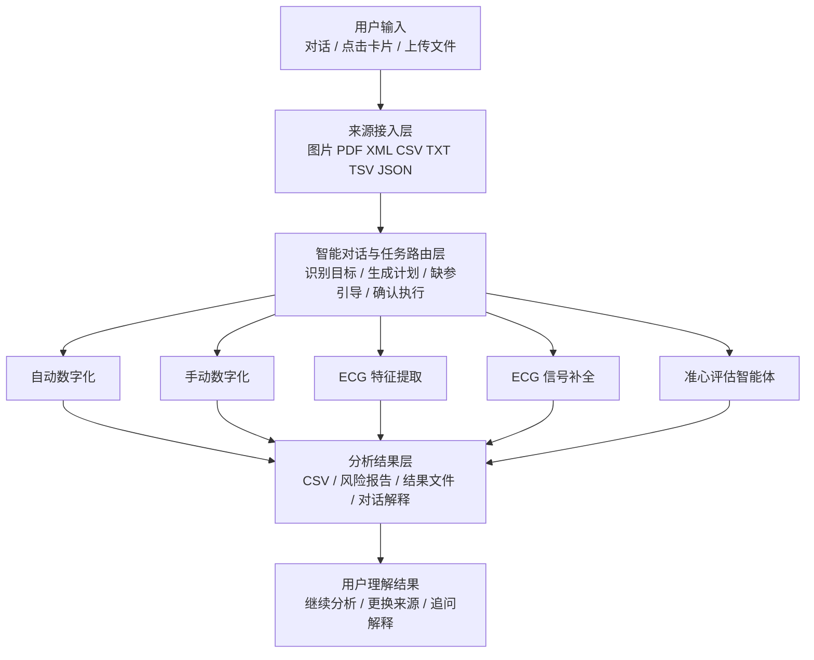

---

## 4. HeartOS 整体工作流

从用户视角看，当前系统的标准流程已经基本成型：

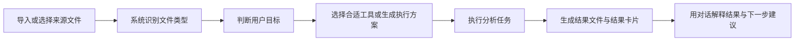

这个流程背后的核心原则是：

1. 先明确用户目标
2. 再决定执行哪个工具
3. 执行完成后，不只给文件，还要给解释

---

## 5. 当前整体产品方案

### 5.1 产品入口

目前 `HeartOS` 的入口主要有两种：

1. 工作台卡片入口
2. 对话助手入口

两者分别承担不同角色：

- 工作台卡片：适合明确知道要用哪个工具的用户
- 对话助手：适合“不知道下一步该做什么”的用户

### 5.2 核心产品机制

当前产品方案已经形成以下机制：

1. 来源先行
   用户先上传或选择来源文件

2. 工具按来源类型分流
   图片/PDF 更适合数字化或准心评估  
   XML/CSV/波形数据更适合特征提取、补全、结果解释

3. 对话负责做任务编排
   对话不只是聊天，而是负责判断用户目标、提示缺失条件、生成执行方案、解释结果

4. 结果展示分两层
   第一层是用户能直接看懂的结果  
   第二层是详细结果文件和原始模型输出

---

## 6. 模块划分总览

当前系统可以按模块分为：

1. 来源管理模块
2. 自动数字化模块
3. 手动数字化模块
4. ECG 特征提取模块
5. ECG 信号补全模块
6. 准心评估智能体模块
7. 智能对话路由模块
8. 结果管理与结果解释模块

下面逐个拆开。

---

## 7. 模块一：来源管理模块

### 7.1 模块目标

负责统一承接用户上传或导入的文件，并为后续工具提供可选择的输入来源。

### 7.2 支持来源

1. 心电图图片
2. PDF
3. ECG XML
4. CSV
5. TXT / TSV / JSON 波形数据

### 7.3 模块职责

1. 文件导入
2. 文件展示
3. 文件勾选
4. 文件预览
5. 文件类型识别
6. 为工具提供“已选来源”

### 7.4 流程图

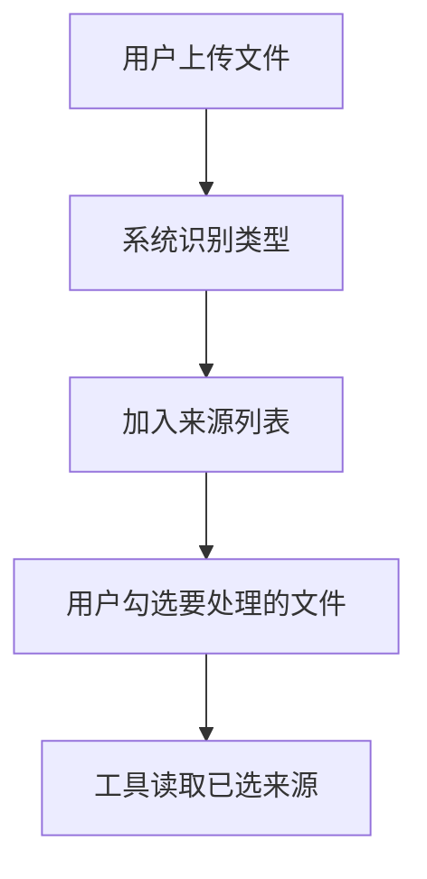

### 7.5 当前定位

这是所有工具的基础模块。  
后续新增任何分析能力，原则上都应该走这套来源选择机制。

---

## 8. 模块二：自动数字化模块

### 8.1 模块目标

将心电图图片或 PDF 自动转为可分析的波形 CSV。

### 8.2 适用场景

1. 用户只有图片/PDF
2. 用户希望快速批量处理
3. 用户不需要人工精细校正

### 8.3 输入输出

- 输入：单个或多个心电图图片/PDF
- 输出：波形 CSV、数字化结果文件、预览结果

### 8.4 流程图

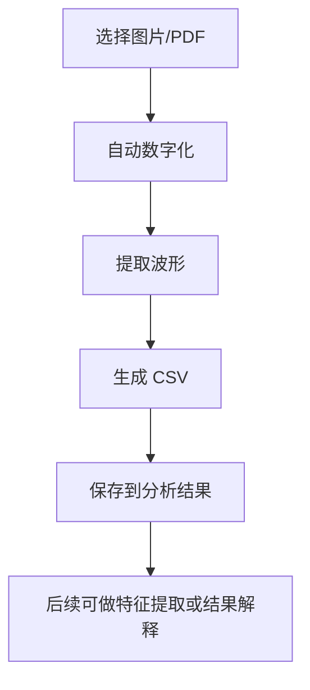

### 8.5 当前产品角色

自动数字化是图片来源进入波形分析流程的标准入口之一。

---

## 9. 模块三：手动数字化模块

### 9.1 模块目标

对单张心电图进行人工辅助的波形提取和校正。

### 9.2 适用场景

1. 自动数字化效果不理想
2. 图片复杂、噪声较多
3. 用户需要更精细地核对导联提取结果

### 9.3 输入输出

- 输入：单个图片/PDF
- 输出：人工校正后的波形 CSV、质量预览、导联结果

### 9.4 流程图

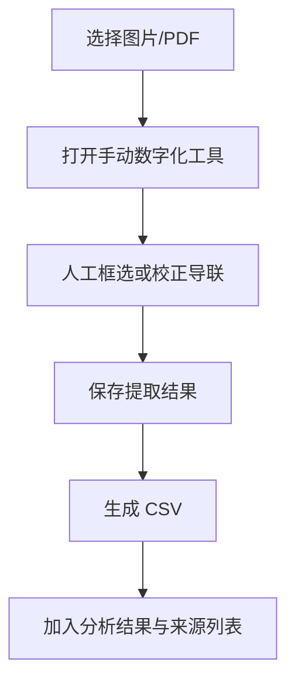

### 9.5 当前产品角色

手动数字化是自动数字化的补充路径，属于精细化处理工具。

---

## 10. 模块四：ECG 特征提取模块

### 10.1 模块目标

基于已有波形数据提取结构化 ECG 特征。

### 10.2 适用场景

1. 已经有 XML 或 CSV 波形
2. 已经完成数字化
3. 想要得到用于研究或分析的结构化特征

### 10.3 输入输出

- 输入：XML / CSV / 其他兼容波形文件
- 输出：特征提取结果、CSV 或分析文件

### 10.4 模块理解

这个模块的本质是：

`在已有波形上读结果`

它不是“补波形”，而是“提特征”。

### 10.5 流程图

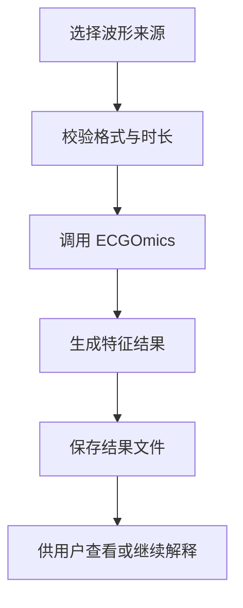

### 10.6 当前产品角色

它是波形分析链条中的“结构化分析”环节。

---

## 11. 模块五：ECG 信号补全模块

### 11.1 模块目标

对缺失导联、不完整波形或分析条件不足的 ECG 数据进行补全与重建。

### 11.2 适用场景

1. 波形缺导联
2. 波形不完整
3. 当前波形不满足后续分析条件

### 11.3 输入输出

- 输入：CSV / XML / TXT / TSV / JSON 波形
- 输出：补全后的波形 CSV、补全结果图像、结果文件

### 11.4 模块理解

这个模块的本质是：

`在波形不完整时先补数据`

### 11.5 流程图

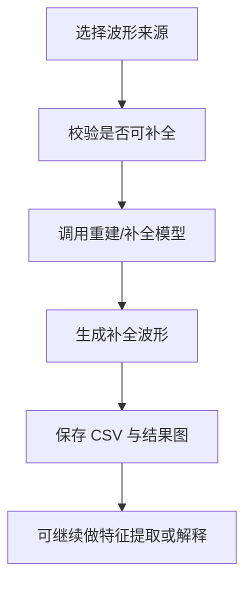

### 11.6 当前产品角色

它是特征提取之前的前置修复工具，也是失败场景下的重要引导路径。

---

## 12. 模块六：准心评估智能体模块

### 12.1 模块目标

基于心电图图片进行六分类胸痛高风险评估，并生成更易懂的风险结论。

### 12.2 适用场景

1. 用户想快速判断风险高低
2. 用户更关心“有没有明显风险”
3. 用户希望得到直观结论，而不是原始模型分数

### 12.3 输入输出

- 输入：单个心电图图片/PDF
- 输出：高/中/低风险结论、建议动作、风险报告文件

### 12.4 流程图

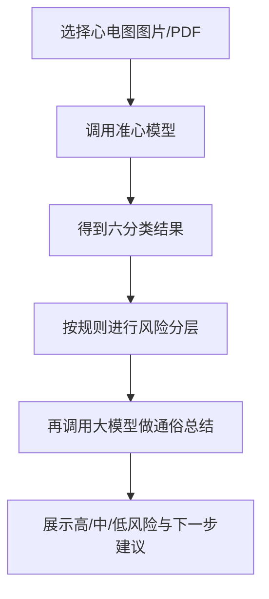

### 12.5 当前产品角色

它更像一个“面向普通用户的快速风险筛查入口”，不是传统波形研究工具。

---

## 13. 模块七：智能对话路由模块

### 13.1 模块目标

把原来“只能回答”升级成“能理解目标、做任务编排、解释结果”的智能助手。

### 13.2 当前能力

1. 识别普通问答
2. 识别工具执行意图
3. 识别结果解释意图
4. 识别缺失条件并给出引导
5. 对模糊目标生成执行方案

### 13.3 当前支持的对话角色

1. 知识问答
2. 任务路由
3. 缺参引导
4. 确认执行
5. 结果解释

### 13.4 流程图

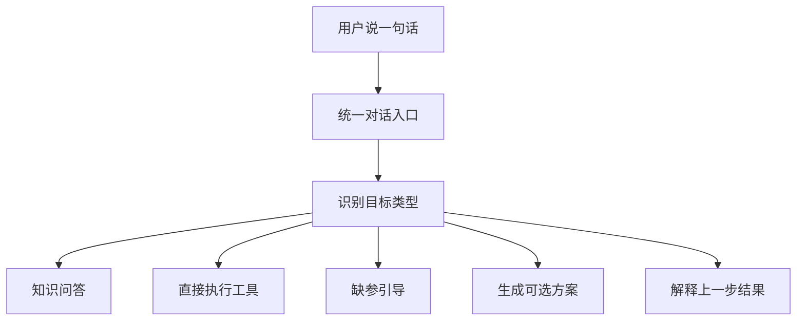

### 13.5 当前产品角色

这是 `HeartOS` 从“工具集合”走向“智能体系统”的关键模块。

---

## 14. 模块八：结果管理与结果解释模块

### 14.1 模块目标

统一管理各模块输出的结果文件、结果卡片和对话解释。

### 14.2 模块职责

1. 保存结果文件
2. 展示分析结果
3. 提供可读性更强的结论
4. 支持进一步追问

### 14.3 流程图

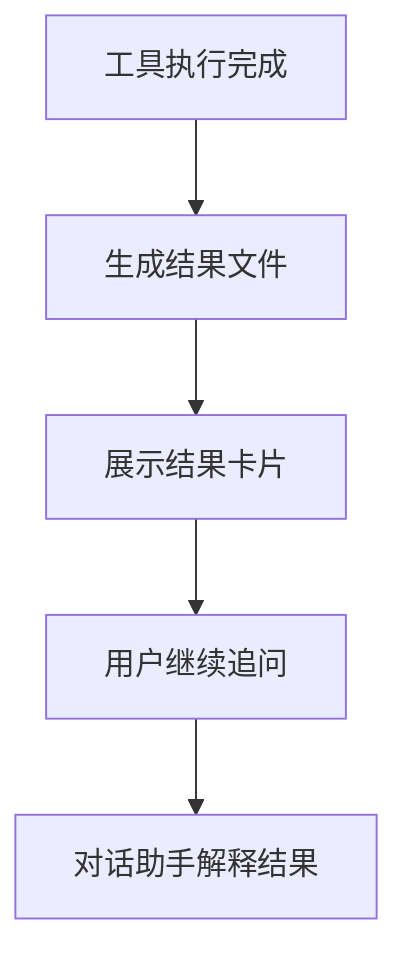

### 14.4 当前产品角色

这个模块决定了用户最终“能不能看懂结果”，是产品体验很关键的一层。

---

## 15. 当前技术架构理解

从技术实现角度看，可以抽象为下面这套结构：

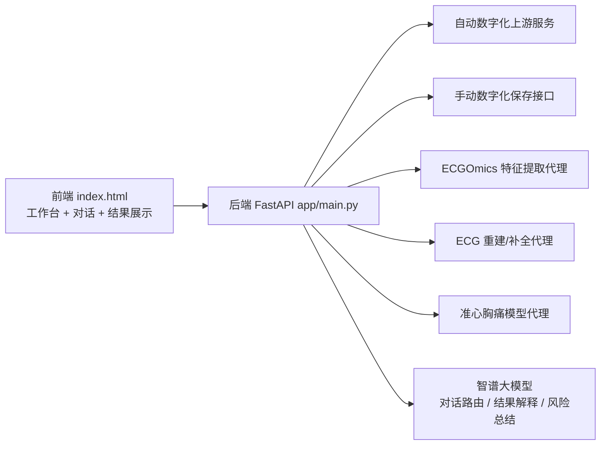

---

## 16. 当前 HeartOS 的阶段判断

如果从产品成熟度来判断，当前 `HeartOS` 已经完成了：

1. 多来源接入
2. 多工具接入
3. 基础结果闭环
4. 对话式任务编排雏形

但还没有完全固化成“正式方案文档”的部分主要有：

1. 统一的产品结构说明
2. 标准化流程图
3. 各模块边界与职责定义
4. 工具之间的标准衔接关系

这份文档的作用，就是先把这一层补齐。

---

## 17. 推荐的后续文档结构

如果你后面要继续往论文、答辩、项目汇报方向整理，建议再拆成 3 份文档：

1. `HeartOS_整体产品方案.md`
   重点写平台定位、用户流程、模块关系

2. `HeartOS_模块设计说明.md`
   重点写每个模块的输入、输出、流程和边界

3. `HeartOS_对话智能体方案.md`
   重点写对话路由、计划生成、结果解释和交互规范

---

## 18. 一句话总结

当前 `HeartOS` 已经可以被定义为：

`一个以来源管理为基础、以多分析工具为核心、以对话智能体为编排层、以结果解释为体验增强层的心电图智能分析平台。`

